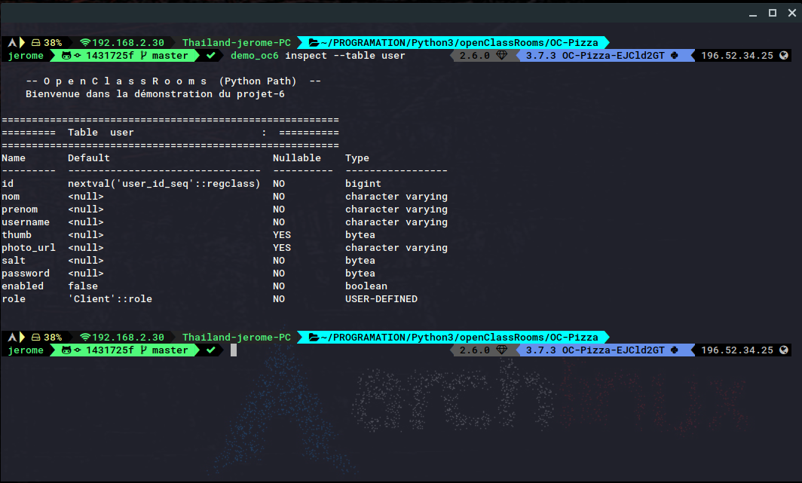

# OpenClassRooms Path Python

## Projet-6 OC-Pizza
Description:
CLI de démonstration pour création de la base de données avec utilisateur, 
role et privilèges.
Cetet application en ligne de commande permet de:
- créer un tuilisateur oc-pizza
- créer un role pour l'utilisateur sur la base de donnée (oc-pizza)
- créer une base de donnée avec accès à l'utilisateur oc-pizza et son role 
privilégié
- créer les types requis pour les tables (enum types)
- créer les tables de la base de donnée
- lire les méta-données des tables (champs et types)
- insérer des données dans le tables interactivement
- Lire les données d'une table (requête SELECT sans condition)
## Outils
- Base de donnée Postgresql
- Python-3.7
- psycopg2
- cli-helpers
- click
- pathlib
- ipykernel (noyau pour l'environnement virtuel pour jupyter)
- pipenv
## Prérequis
- un serveur de base de données Postgresql actif
- Python en version 3.7 minimum
- pipenv installé et configuré
##Installation
un fichier setup.py permet d'installer l'application sur vôtre système
```bash
pipenv install
pipenv shell
pipenv run pip install --editable .
```
(n'oubliez pas de sortir de l'environnement virtuel à la fin: exit)
## utilisation
l'application est équipé d'un manuel d'aide succinct:
```bash
demo_oc6 --help
demo_oc6 create --help
```
Pour voir le contenu de la base (les tables):
```bash
demo_oc6 inspect --tables
```
Pour voir les champs d'une table ("user" par exemple):
```bash
demo_oc6 inspect --table user
```
